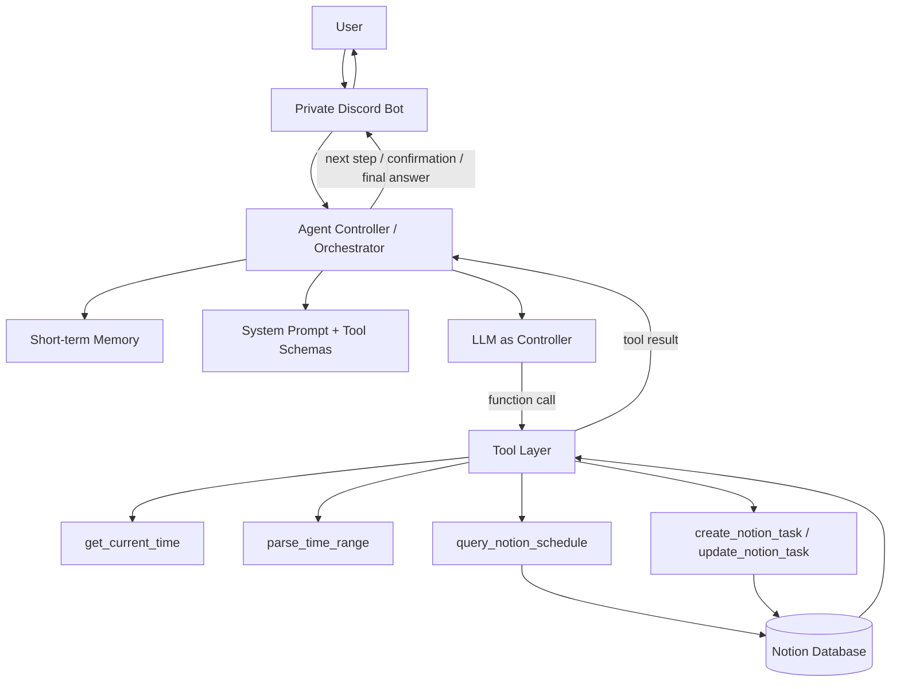
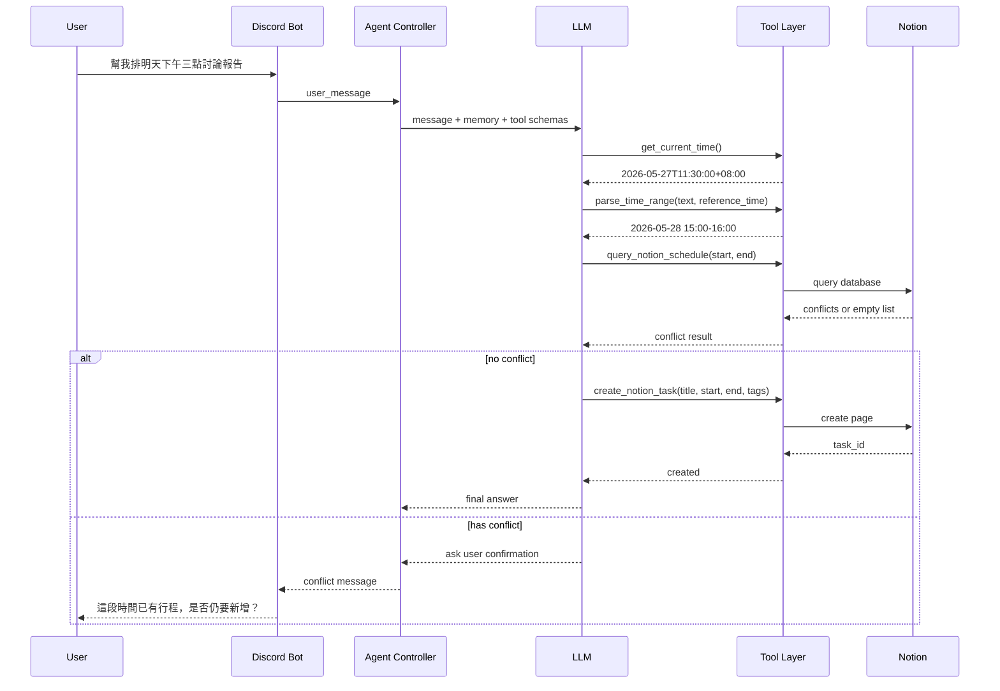
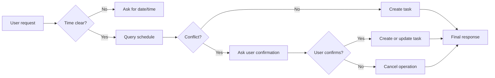

# Notion 智慧排程代理 Infographic

## Architecture Pipeline

```mermaid
flowchart TD
    U[User] --> D[Private Discord Bot]
    D --> A[Agent Controller / Orchestrator]
    A --> M[Short-term Memory]
    A --> P[System Prompt + Tool Schemas]
    A --> L[LLM as Controller]
    L -->|function call| T[Tool Layer]
    T --> C[get_current_time]
    T --> R[parse_time_range]
    T --> Q[query_notion_schedule]
    T --> N[create_notion_task / update_notion_task]
    Q --> DB[(Notion Database)]
    N --> DB
    DB --> T
    T -->|tool result| A
    A -->|next step / confirmation / final answer| D
    D --> U
```

## Function Calling Sequence

```mermaid
sequenceDiagram
    participant User
    participant Bot as Discord Bot
    participant Agent as Agent Controller
    participant LLM
    participant Tools as Tool Layer
    participant Notion

    User->>Bot: 幫我排明天下午三點討論報告
    Bot->>Agent: user_message
    Agent->>LLM: message + memory + tool schemas
    LLM->>Tools: get_current_time()
    Tools-->>LLM: 2026-05-27T11:30:00+08:00
    LLM->>Tools: parse_time_range(text, reference_time)
    Tools-->>LLM: 2026-05-28 15:00-16:00
    LLM->>Tools: query_notion_schedule(start, end)
    Tools->>Notion: query database
    Notion-->>Tools: conflicts or empty list
    Tools-->>LLM: conflict result
    alt no conflict
        LLM->>Tools: create_notion_task(title, start, end, tags)
        Tools->>Notion: create page
        Notion-->>Tools: task_id
        Tools-->>LLM: created
        LLM-->>Agent: final answer
    else has conflict
        LLM-->>Agent: ask user confirmation
        Agent-->>Bot: conflict message
        Bot-->>User: 這段時間已有行程，是否仍要新增？
    end
```

## Decision Rules

```mermaid
flowchart LR
    S[User request] --> T1{Time clear?}
    T1 -- No --> AskTime[Ask for date/time]
    T1 -- Yes --> T2[Query schedule]
    T2 --> C{Conflict?}
    C -- No --> Create[Create task]
    C -- Yes --> Confirm[Ask user confirmation]
    Confirm --> U{User confirms?}
    U -- Yes --> Write[Create or update task]
    U -- No --> Cancel[Cancel operation]
    Create --> Done[Final response]
    Write --> Done
    Cancel --> Done
```
