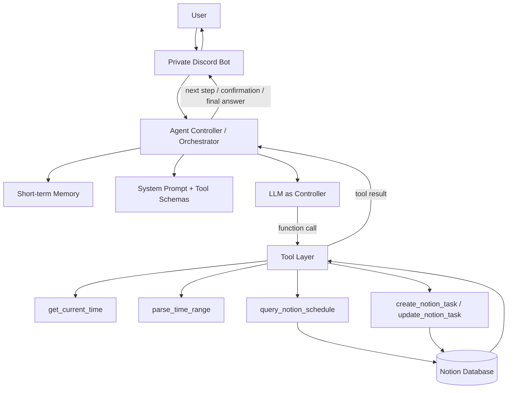
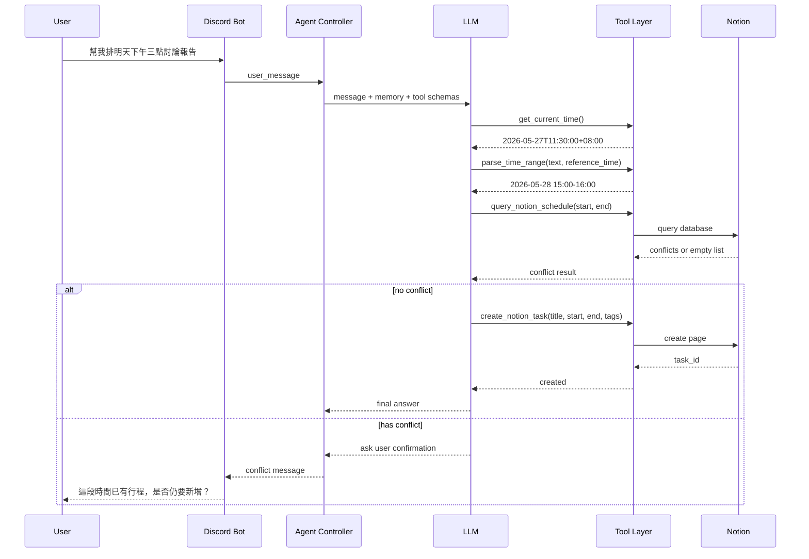
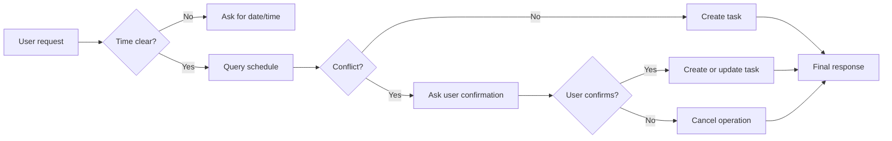

# Notion 智慧排程代理：AI Harness 系統設計報告

## 1. 問題定義與使用情境

本專案設計一個個人智慧排程助理的 AI Harness。使用者可以用自然語言提出排程需求，例如「幫我排明天下午三點和同學討論報告」或「把下午的會議改到四點」。系統需要理解使用者意圖、解析相對時間、查詢既有行程、判斷是否衝突，並在安全的情況下建立或更新 Notion 任務。

這個問題適合用 AI Harness 處理，因為單靠 LLM 不能直接信任其內部推測結果。排程任務需要外部工具提供目前時間、結構化時間解析、Notion database 查詢與寫入能力。因此 LLM 的角色不是資料來源，而是 system controller：負責判斷何時呼叫工具、如何解讀 tool result、下一步要繼續執行或要求使用者確認，以及如何產生最終回覆。

HW4 的重點是系統設計，而不是完成 production product。不過本專案也實作了一個單人使用的 MVP 來驗證設計。MVP 使用 Discord 作為使用者介面、Gemini 作為 function-calling controller、Python functions 作為 tool layer，並以 Notion 作為任務資料庫。此原型刻意限制在私人 Discord server 的個人使用情境，不處理多人權限、長期記憶或正式部署可靠性等較大的工程問題。

## 2. AI Harness 系統架構

系統包含六個主要元件：

| 元件 | 職責 |
| --- | --- |
| User / Discord Bot | 接收自然語言排程需求，並將最終結果回覆給使用者 |
| Agent Controller | 管理 orchestration loop、memory、tool result 與使用者確認流程 |
| LLM | 判斷使用者意圖、選擇工具呼叫、解讀工具輸出並產生回覆 |
| Short-term Memory | 保存近期對話狀態、待確認操作與中間結果 |
| Tool Layer | 提供時間查詢、行程查詢、Notion 寫入等可執行功能 |
| Notion Database | 儲存任務與行程資料，例如標題、起訖時間、分類、狀態與備註 |

此架構的核心原則是分離「推理」與「執行」。LLM 負責控制 workflow，但不能直接修改 Notion。所有外部動作都必須透過明確定義且 allowlisted 的 function 完成。這樣可以讓系統更容易檢查、測試與限制風險。



## 3. Tool 與 Function Calling 設計

本設計包含五個工具。前三個工具是排程 workflow 的核心，後兩個工具負責實際建立與更新 Notion 任務。

### Tool 1: `get_current_time()`

此工具用來取得目標時區的目前時間。使用者輸入「今天」、「明天」、「下週三」等相對時間時，系統必須先取得 reference time 才能正確解析。

```json
{
  "name": "get_current_time",
  "input": {},
  "output": {
    "timezone": "Asia/Taipei",
    "current_time": "2026-05-27T11:30:00+08:00"
  }
}
```

若此工具失敗，Agent 應要求使用者提供明確日期與時間，而不是自行猜測。

### Tool 2: `parse_time_range(text, reference_time)`

此工具將自然語言時間轉換為結構化的起訖時間。

```json
{
  "name": "parse_time_range",
  "input": {
    "text": "明天下午三點到四點",
    "reference_time": "2026-05-27T11:30:00+08:00"
  },
  "output": {
    "start_time": "2026-05-28T15:00:00+08:00",
    "end_time": "2026-05-28T16:00:00+08:00",
    "confidence": 0.93
  }
}
```

若時間模糊或不合法，Agent 不應寫入 Notion，而應請使用者補充更清楚的日期、時間或持續時間。

### Tool 3: `query_notion_schedule(start_time, end_time)`

此工具查詢指定時間區間是否與既有 Notion 行程重疊。

```json
{
  "name": "query_notion_schedule",
  "input": {
    "start_time": "2026-05-28T15:00:00+08:00",
    "end_time": "2026-05-28T16:00:00+08:00"
  },
  "output": {
    "conflicts": [
      {
        "task_id": "abc123",
        "title": "Project Meeting",
        "start_time": "2026-05-28T15:30:00+08:00",
        "end_time": "2026-05-28T16:30:00+08:00"
      }
    ]
  }
}
```

若 Notion 查詢失敗，Agent 必須停止寫入流程。系統不能假設該時段沒有衝突。

### Tool 4: `create_notion_task(title, start_time, end_time, tags)`

此工具用來建立新的 Notion 任務。它只能在目標時段確認沒有衝突，或使用者明確同意即使有衝突仍要新增時執行。

```json
{
  "name": "create_notion_task",
  "input": {
    "title": "討論報告",
    "start_time": "2026-05-28T15:00:00+08:00",
    "end_time": "2026-05-28T16:00:00+08:00",
    "tags": ["school"]
  },
  "output": {
    "task_id": "new456",
    "status": "created"
  }
}
```

### Tool 5: `update_notion_task(task_id, new_start_time, new_end_time)`

此工具用來更新既有任務，例如處理「把下午的會議改到四點」。在呼叫此工具前，Agent 必須先確認目標任務只有一個，並檢查新的時間是否和其他行程衝突。

```json
{
  "name": "update_notion_task",
  "input": {
    "task_id": "abc123",
    "new_start_time": "2026-05-28T16:00:00+08:00",
    "new_end_time": "2026-05-28T17:00:00+08:00"
  },
  "output": {
    "task_id": "abc123",
    "status": "updated"
  }
}
```

## 4. Agent Workflow 與 Orchestration

新增行程的標準 workflow 如下：

1. 使用者送出自然語言排程需求。
2. Discord Bot 將訊息轉交給 Agent Controller。
3. Agent Controller 將使用者訊息、short-term memory 與 tool schemas 提供給 LLM。
4. LLM 呼叫 `get_current_time()` 建立相對時間解析基準。
5. LLM 呼叫 `parse_time_range()` 取得明確時間區間。
6. LLM 呼叫 `query_notion_schedule()` 檢查是否有衝突。
7. 若無衝突，LLM 呼叫 `create_notion_task()`。
8. 若有衝突，Agent 先詢問使用者確認，不直接寫入 Notion。
9. 使用者確認後，Agent 才建立或更新任務，並回傳最終結果。



主要決策規則如下：



這些規則可以避免常見的 agent 錯誤，例如時間尚未明確就寫入、跳過衝突檢查、未經確認修改使用者資料，或在工具失敗後仍宣稱成功。

## 5. Evaluation 方法

本系統使用小型但有針對性的測試集進行 evaluation。目標不是測量模型的一般智慧，而是檢查 AI Harness 是否遵守必要的 tool use、workflow 與 orchestration 規則。

| 評估指標 | 目標 |
| --- | --- |
| 時間解析正確性 | 10 筆自然語言時間案例中至少 8 筆正確 |
| 衝突偵測 | 5 筆重疊案例都能正確處理 |
| Tool calling 順序 | 100% 符合指定 workflow |
| 使用者確認行為 | 發現衝突時 100% 先詢問再寫入 |
| 回覆清楚度 | 最終回覆包含動作、時間與結果 |

| ID | 使用者輸入 | Mock database 狀態 | 預期 tool flow | 預期結果 |
| --- | --- | --- | --- | --- |
| E01 | 明天下午三點開會一小時 | 目標時間無行程 | get_current_time -> parse_time_range -> query_notion_schedule -> create_notion_task | 建立明天 15:00-16:00 的行程 |
| E02 | 今天晚上七點到八點健身 | 目標時間無行程 | get_current_time -> parse_time_range -> query_notion_schedule -> create_notion_task | 建立今天 19:00-20:00 的行程 |
| E03 | 下週三早上和老師討論 | 目標時間無行程 | get_current_time -> parse_time_range -> query_notion_schedule -> create_notion_task | 以預設一小時長度建立行程 |
| E04 | 明天三點排一個新行程 | 已有 15:30-16:30 行程 | get_current_time -> parse_time_range -> query_notion_schedule | 偵測衝突並要求使用者確認 |
| E05 | 把下午的會議改到四點 | 找到既有會議 | get_current_time -> parse_time_range -> query_notion_schedule -> update_notion_task | 確認新時間無衝突後更新會議 |
| E06 | 週末找時間讀書 | 時間模糊 | get_current_time -> parse_time_range | 要求使用者提供明確日期與時間 |
| E07 | 明天三點到兩點討論 | 時間區間不合法 | get_current_time -> parse_time_range | 拒絕不合法時間並要求修正 |
| E08 | 下週五 10:00 demo | Notion 查詢失敗 | get_current_time -> parse_time_range -> query_notion_schedule | 停止流程並回報查詢失敗 |
| E09 | 明天 15:00 和同學討論報告 #school | 目標時間無行程 | get_current_time -> parse_time_range -> query_notion_schedule -> create_notion_task | 建立帶有 school tag 的行程 |
| E10 | 剛剛那個衝突還是幫我加上去 | Memory 中有待確認衝突 | create_notion_task | 只有在使用者確認後才建立行程 |

每次 evaluation 應記錄使用者輸入、tool calls 順序、tool input/output、關鍵決策點，以及最終回覆。這些 log evidence 可直接用來檢查 workflow correctness 與 orchestration quality。

## 6. Prototype 範圍與實作說明

本專案的 MVP 是用來驗證設計是否可執行。Discord 保持為介面層，controller 可以使用 mock agent 進行測試，也可以使用 Gemini function-calling controller 作為較接近實際使用的路徑。Notion function adapter 則作為 guardrail layer，只暴露核准過的操作給 LLM，避免 Gemini 直接存取原始 Notion client。

實作延伸出的結構如下：

| Layer | 對應模組 | 目的 |
| --- | --- | --- |
| Discord adapter | `run_bot/discord_bot.py` | 接收 Discord 訊息並送出回覆 |
| LLM controller | `LLM_agent/gemini_controller.py` | 管理 Gemini prompt、tool declarations 與 tool-call loop |
| Notion guardrail layer | `notion_function/adapter.py` | 驗證並派發 allowlisted Notion functions |
| Notion tools | `notion_function/tools.py` | 實作任務建立、更新、刪除與搜尋 |

這個實作可以證明設計具備可執行性，但仍屬於個人用 MVP。它沒有處理多使用者資料隔離、OAuth 帳號綁定、高可用部署，也沒有完整的長期記憶機制。

## 7. 限制與未來改進

目前設計假設只有單一使用者、固定 Notion database schema，以及 Asia/Taipei 時區。像「週末找時間」或「下次開會前」這類模糊描述仍需要使用者補充資訊。Notion API 失敗與 LLM quota 限制也需要更完整的 fallback 行為。

未來可以加入 per-user session memory、支援多個 Notion workspace、改善時間解析上下文、加入 retry 與 observability，並將 evaluation cases 自動化成 regression tests。更進階的版本也可以使用 LangGraph 等 state-machine framework 管理狀態，但目前設計選擇保留明確的 orchestration 流程，以便符合 HW4 對系統設計與可解釋性的要求。
